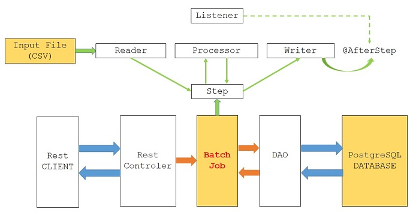

# Mobi7

ETL

Colab

https://colab.research.google.com/drive/1hJwEMGdumnLQPfjMkfXGWTu8Ftt8TzzB?usp=sharing

Requisitos Funcionais obrigatórios:
        • Arquivo CSV constando (Nome do arquivo – resultados_consolidado_POIs.csv):
        • Quantidade de tempo que os veículos passaram parados dentro de cada POI;
        • Quantidade de tempo que os veículos estavam dentro de cada POI;
        • Tempo total da frota gasto parado em cada POI;
        • Tempo total parado por veículo, independente do POI.

BATCH JAVA

https://github.com/GCPBigData/Projeto-Mobi7/tree/main/batch

API JAVA

https://github.com/GCPBigData/Projeto-Mobi7/tree/main/java

FRONT END ANGULAR

https://github.com/GCPBigData/Projeto-Mobi7/tree/main/front

Requisitos funcionais não-obrigatórios:
    • É nice to have os itens descritos acima mostrados em um dashboard.
    
Requisitos Não-Funcionais:
    • Fontes:
        • O código fonte deve ser publicado em repositório público (por exemplo github através de uma conta free) até a data e horário combinado em e-mail;
        • Todo artefato usado em desenvolvimento deve ser salvo no repositório;
        • Deve existir um arquivo README.md com as instruções de como rodar e testar o seu aplicativo.
        • Tecnologias permitidas:
        • Banco de Dados: escolha livre por parte do candidato desde que Open-Source (Não é obrigatório o uso de banco de dados para executar esta prova);
        • Linguagem: Independente, desde que seja open-source e permita executar os testes automaticamente;   
        
         
